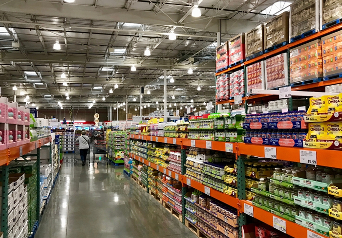
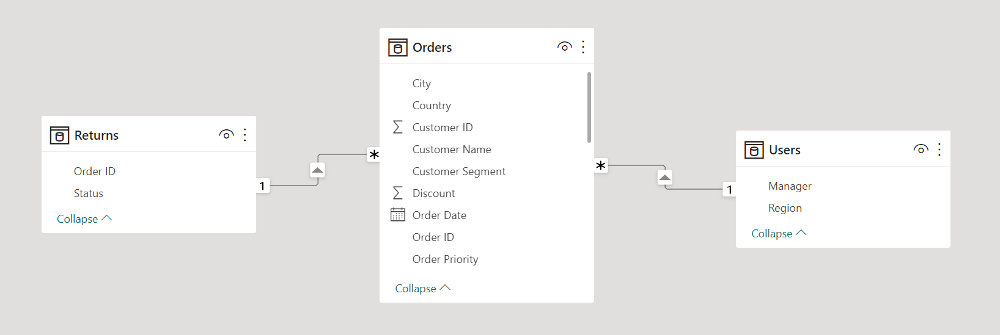
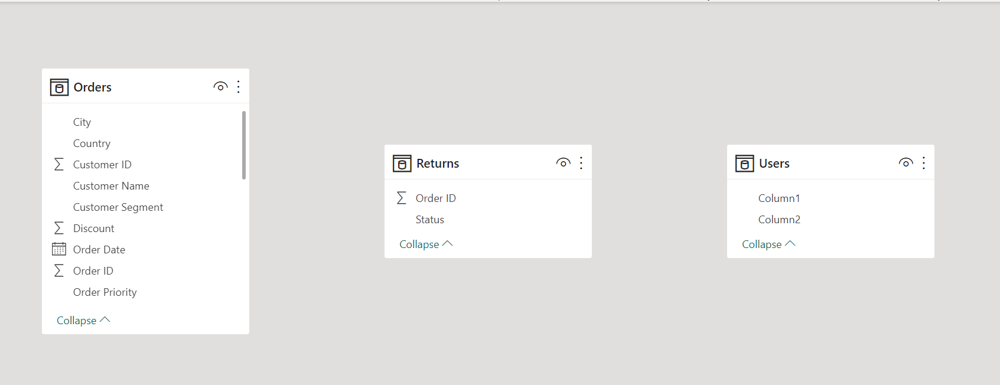
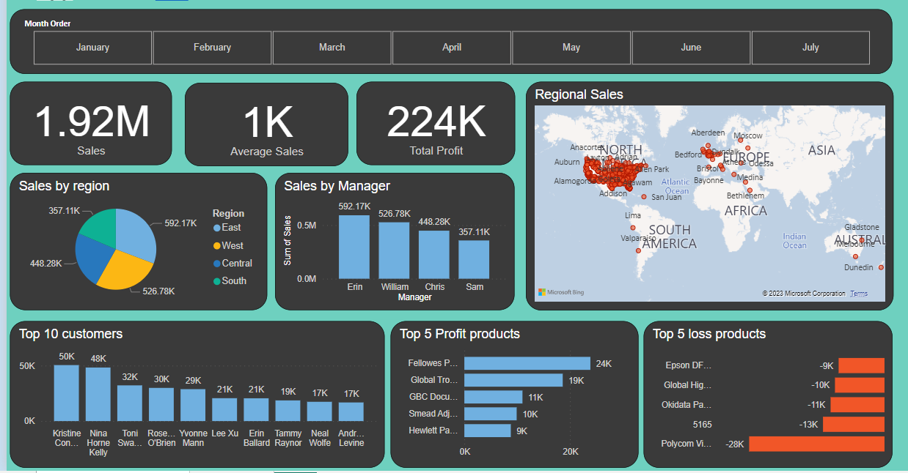
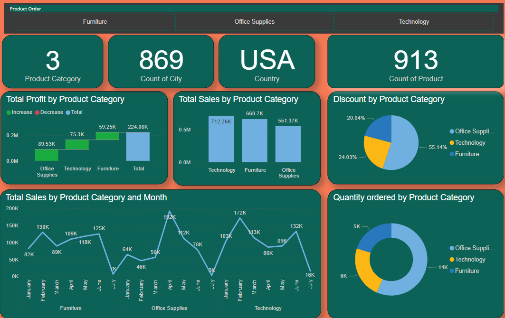

# Supermarket Analysis

## Introduction:

This is a Power Bi project on transactions and Product category analysis of an adopted mart called **Supermarket**.
The goal of this project is to analyse data, generate insights, and assist in the data-driven decision-making process.

**_Disclaimer**_: All datasets lack accuracy, they do not fairly reflect any organisation, institution, or nation_.

## Problem statement:

1. What are the top 5 products that generate the most revenue for supermarket?

2. Which top 5 products the supermarket lost the most revenue from?

3. What is the sales performace by each manager?

4. How much money did the company make overall in the first half of the year? (Jan-June)

## Skill/ Concept demonstrated:

The following power Bi features were incorporated:
- Transform data, 
- Dax, 
- Quick measures, 
- Page navigation, 
- Modelling, 
- Filter.

## Modelling:

Automatically generated relationships are modified to remove undesirable ties and replace them with those that are necessary.

Adjusted Model           | Auto Model
:-----------------------:|:-----------------------: 
  |   

The model is a star schema.

## Visualization

The report comprises of 2 pages

### Transactions

### Product

You can interact with the report [here] (https://app.powerbi.com/groups/me/reports/26450221-14a6-4ff0-b202-b8239ec46ea6/ReportSection)

## Insight and recommendation

### _Insight_

- Three of the top five profitable products were office supplies category.

- None of the top 5 loss products are in the office supplies category.

- Office supplies make up 57% of the three product categories that were ordered (technology, furniture, and office supplies).
Therefore, throughout the sales period for which this study was conducted, office supplies received the most orders.

- 

### _Recomendation_

